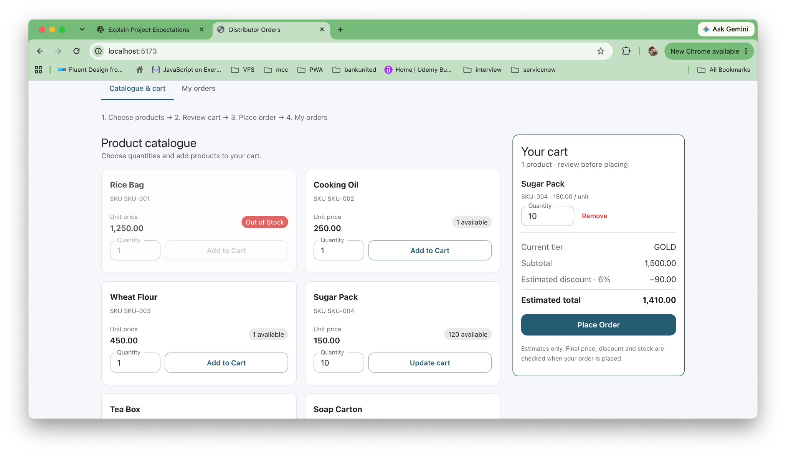
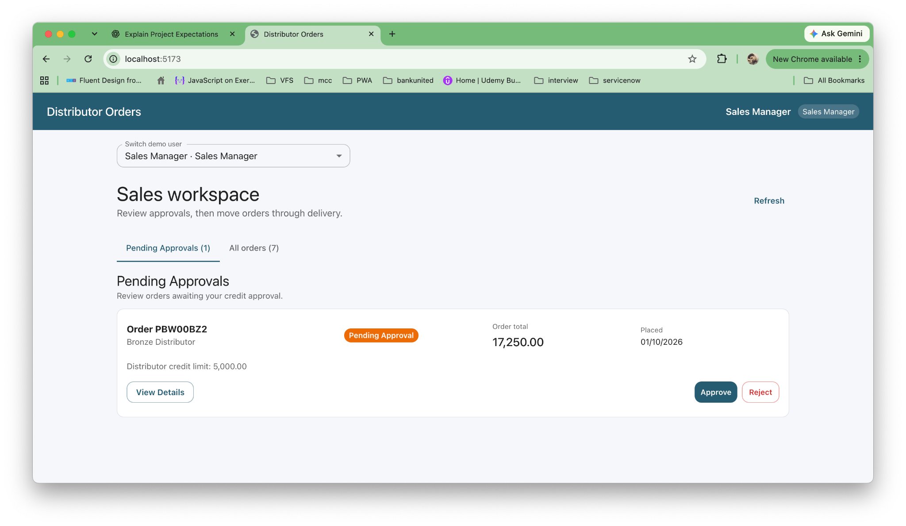
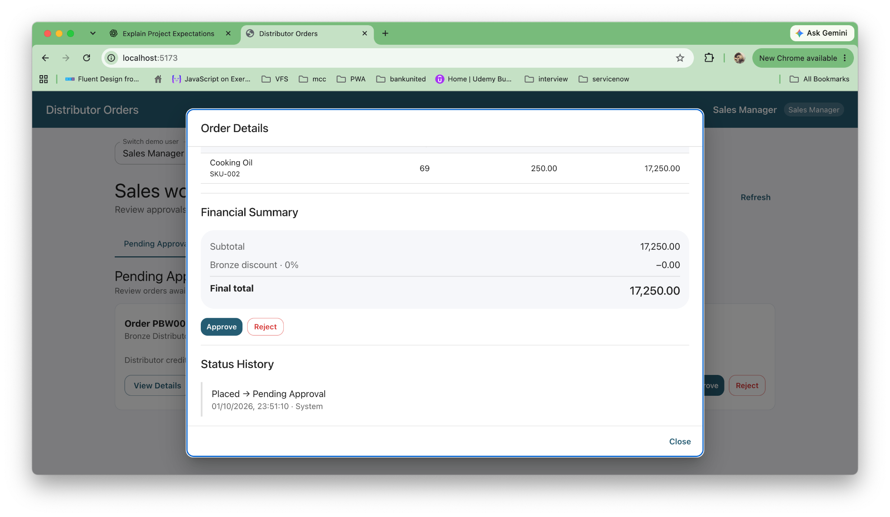

# Distributor Orders — Head of Sales

## Slide 1 — A clearer path from demand to delivery

- Distributors need to know what is available before placing an order.
- Sales teams need a consistent way to handle credit exceptions.
- Stock commitments and loyalty rewards need to remain reliable as orders change.
- Replace scattered order messages and manual reconciliation with one shared workflow.

---

## Slide 2 — Order with confidence

- Browse products, prices and available stock, including unavailable products.
- Build one order with several products and see its confirmed price and status.
- See current credit, loyalty points and tier; qualifying tiers earn better discounts.

A Gold distributor reviews 10 Sugar Packs: subtotal 1,500, estimated 6% discount and total 1,410. Unavailable products remain visible.

---

## Slide 3 — Control credit exceptions and stock commitments

- Orders within available credit are confirmed automatically.
- Orders above available credit wait for Sales Manager approval.
- Stock is reserved together for the entire order, protecting the final available unit.
- Rejection or eligible cancellation releases the stock commitment.

A Bronze distributor order of 17,250 awaits approval against a credit limit of 5,000.

---

## Slide 4 — Follow through to delivery

- Managers dispatch confirmed orders and record delivery.
- Order details preserve prices, discounts and the history of who changed each status.
- Confirmation awards loyalty points; eligible cancellation reverses them.
- Every new status change queues an ERP notification; temporary delivery failures retry.

Order details show the fixed total of 17,250 and the Placed → Pending Approval transition, recorded with System actor and timestamp.

---

## Slide 5 — Requirements to go live

- Integration: agree the ERP event contract, access requirements and duplicate handling; validate with the ERP owner.
- Data migration: verify products, prices, warehouse balances, distributor credit and recent loyalty history.
- Rollout: pilot with a small distributor group, train Sales Managers, reconcile outcomes and expand gradually.
- Operations: define responsibility for failed notifications, support and recovery.
- Business value: clearer ordering, protected stock commitments, consistent approvals and visible loyalty benefits.
